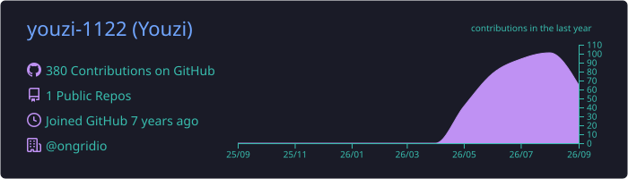

 

## 👨‍💻 About Me

- 🔭 Backend & Infrastructure Engineer building reliable cloud-native systems
- ⚙️ Open-source contributor working mainly with Go and Kubernetes
- 🧭 Interested in observability, automation, and developer-facing infrastructure
- 💡 I build useful things that solve real operational problems

## 🚧 Current Focus

- Building infrastructure-aware AI agents for Kubernetes operations
- Improving secure connectivity for devices and applications behind NAT
- Making infrastructure easier to observe, operate, release, and recover

## 🧰 Tech Stack

  <strong>Core</strong>  
  

  <strong>Tooling & Data</strong>  
  

## 🌐 Open Source Contributions

<table>
  <tr>
    <td width="50%" valign="top">
      <h3>🚀 <a href="https://github.com/ongridio/ongrid">ongridio/ongrid</a></h3>
      
Infrastructure-aware Ops AI Agent for root-cause analysis and automated remediation.

      
<strong>Contributing across:</strong> Kubernetes operations, observability, release engineering, alerts, and platform reliability.

      

        
        
      

      
<a href="https://github.com/ongridio/ongrid/pulls?q=is%3Apr+is%3Amerged+author%3Ayouzi-1122"><strong>View my merged PRs →</strong></a>

    </td>
    <td width="50%" valign="top">
      <h3>🔐 <a href="https://github.com/liaisonio/liaison">liaisonio/liaison</a></h3>
      
Secure connectivity for devices and applications across NAT environments.

      
<strong>Contributing across:</strong> web access, lifecycle consistency, release automation, security controls, and remote operations.

      

        
        
      

      
<a href="https://github.com/liaisonio/liaison/pulls?q=is%3Apr+is%3Amerged+author%3Ayouzi-1122"><strong>View my merged PRs →</strong></a>

    </td>
  </tr>
  <tr>
    <td colspan="2" valign="top">
      <h3>🤖 <a href="https://github.com/NousResearch/hermes-agent">NousResearch/hermes-agent</a></h3>
      
A self-improving AI agent with tools, skills, memory, and multi-platform integrations.

      
<strong>Contributing across:</strong> provider validation, asynchronous runtime reliability, model compatibility, and regression testing.

      

        
        
      

      
<a href="https://github.com/NousResearch/hermes-agent/pull/77695"><strong>View my merged contribution →</strong></a>

    </td>
  </tr>
</table>

## 📊 GitHub Stats

  

## 🐍 Contribution Snake

  <picture>
    <source media="(prefers-color-scheme: dark)" srcset="https://raw.githubusercontent.com/youzi-1122/youzi-1122/output/github-snake-dark.svg" />
    <source media="(prefers-color-scheme: light)" srcset="https://raw.githubusercontent.com/youzi-1122/youzi-1122/output/github-snake.svg" />
    
  </picture>

<h3 align="center">⚡ Keep coding. Keep creating.</h3>

